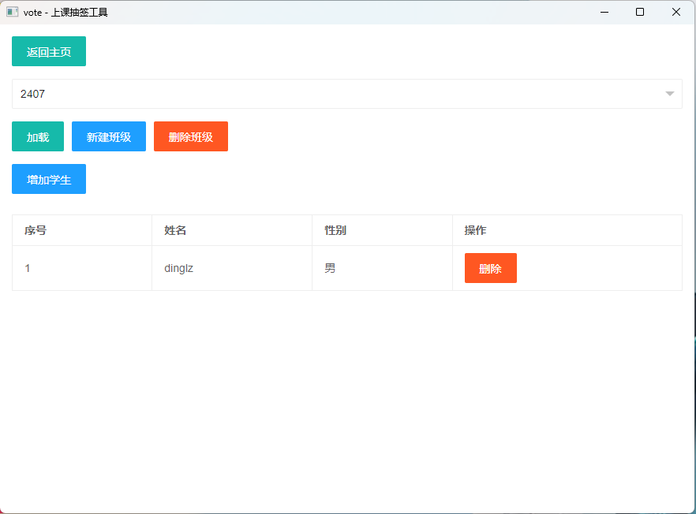
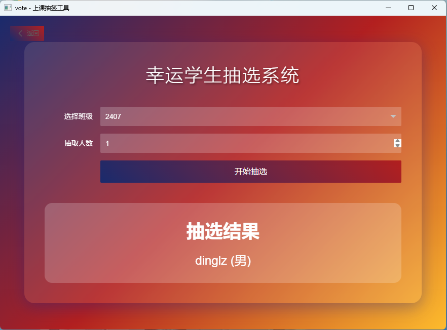

## 概览

Vote - 学生抽取软件

### 应用场景

上课时老师需要抽取同学回答问题，或者抽取一组同学进行活动的情况

### 实现功能

- 管理抽取列表，可以添加、删除班级，添加、删除学生。

- 在已添加的班级中抽取指定数量的学生。

## 实现方法

[**webview**](https://github.com/webview/webview) + **layui** 实现UI部分

**sqlite** + [**sqlite_orm**](https://github.com/fnc12/sqlite_orm) 实现数据存储部分

## 亮点

- 使用sqlite存储数据

- 贴合日常使用需求

- 友好的api

- 方便的数据迁移能力

- 轻量级

## 使用方法

1. 进入管理学生名单界面，进行创建班级，为班级添加学生等操作。

2. 添加完毕抽取名单后，回到主页，进入抽签界面进行抽取。

## 画廊





## 感想

本项目作为我们的大一程序设计的结课项目，我的三个队友在开发本项目的过程中第一次接触到了git、github、cmake，对于那些只会c语言语法的同学，我很难想象他们如何合作顺利地开发一个项目，大部分的同学甚至以为一个程序只能在一个.c文件中实现。这个结课任务对他们来说可能是艰巨的。而我的三个队友，尽管我针对git的使用、cmake的使用、sqlite_orm的使用录了视频，推荐了相关文章，学习和使用起来也十分吃力。然而我们学校并不算一个很差的学校，大家也整整学习了半年的时间了。怎么说呢，我很难评价。

## 开发

[开发任务列表](./task)

## 编译

### 前置工具

- CMake

- Git

- Vcpkg

- 任一cmake支持的编译器

### 引入vscpkg支持

如果未安装vcpkg，可在[通过 CMake 安装和使用包 | Microsoft Learn](https://learn.microsoft.com/zh-cn/vcpkg/get_started/get-started)中找到方法。由于项目已完成CMakeLists的设置，如果你参照这个链接，仅需完成步骤1、4即可，4与我们下面的操作完全相同。

你需要在目录下新建两个文件

#### CMakePresets.json

```json
{
    "version": 2,
    "configurePresets": [
      {
        "name": "vcpkg",
        "generator": "Ninja",
        "binaryDir": "${sourceDir}/build",
        "cacheVariables": {
          "CMAKE_TOOLCHAIN_FILE": "$env{VCPKG_ROOT}/scripts/buildsystems/vcpkg.cmake"
        }
      }
    ]
}
```

你可以修改Ninja为一个你需要的编译器，例如**Visual Studio 17 2022**，可用的选项你可以通过**cmake --help**，在Generators中找到。

#### CMakeUserPresets.json

```json
{
    "version": 2,
    "configurePresets": [
      {
        "name": "default",
        "inherits": "vcpkg",
        "environment": {
          "VCPKG_ROOT": "你的vcpkg所在的路径"
        }
      }
    ]
}
```

创建完成这两个文件后，你可以进行下一步操作

### 生成

```bash
mkdir build
cd build
cmake --preset=default ..
```

```bash
cmake --build .
```

## Contributors

<a href="https://github.com/dingdinglz/vote/graphs/contributors">
  
</a>

Contributor Image Made with [contrib.rocks](https://contrib.rocks).